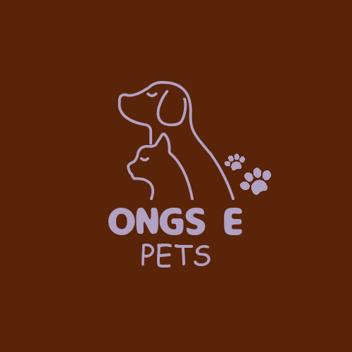

<p align="center">
  <a href="http://nestjs.com/" target="blank"></a>
</p>
 

## Description

Ong and Pets Project Its objective is to facilitate the search for NGOs in your location.


## Swagger
#dev
http://localhost:3000/api

## Installation

```bash
$ npm install
```

## Running the app

```bash
# development
$ npm run start

# watch mode
$ npm run start:dev

# production mode
$ npm run start:prod
```

## Test

```bash
# unit tests
$ npm run test

# e2e tests
$ npm run test:e2e

# test coverage
$ npm run test:cov
```

## Stay in touch

- Author - [Patricia Oliveira](https://www.linkedin.com/in/patricia-silva-oliveira-/)